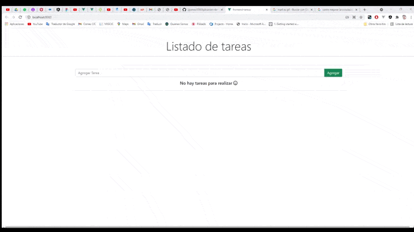

# Aplicacion de trareas con Vue3 NetCore + EFC
Aplcación de tareas que emplea VUE 3 en el Frontend, .Net Core API en el  backend, SQL-Server como gestor de base de datos y Entity Framework como Mapeo de Objecto Relacional (ORM).

 

